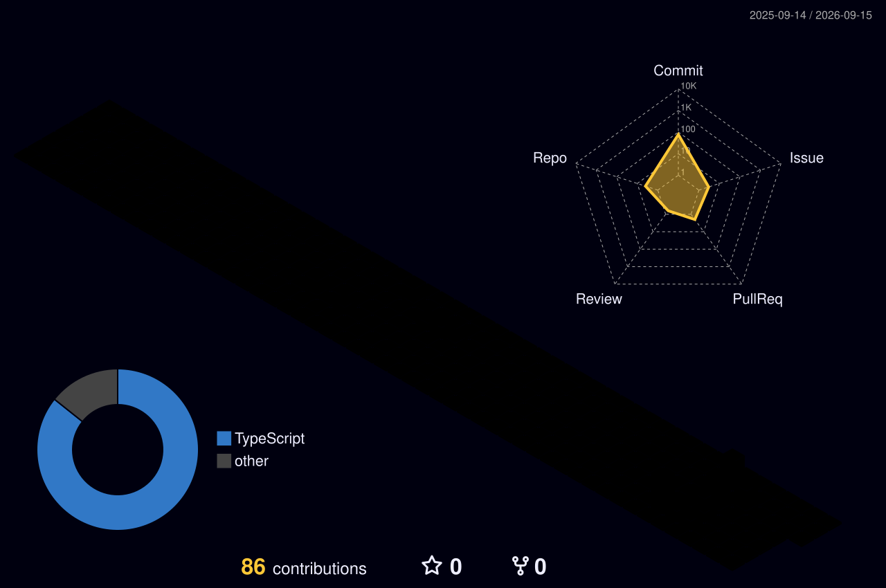

<!-- HEADER -->

<!-- TYPING -->

  <picture>
    <source media="(prefers-color-scheme: dark)" srcset="https://readme-typing-svg.demolab.com?font=Fira+Code&weight=600&size=23&pause=1000&color=8B5CF6&center=true&vCenter=true&random=false&width=680&lines=3%2B+years+building+secure%2C+real-time+web+apps;Auth+%26+access+control+%E2%80%A2+OAuth+2.0+%E2%80%A2+SSO+%E2%80%A2+RBAC;Real-time+systems+at+1000%2B+updates%2Fsec;AI+%2F+LLM+integration+%E2%9C%A8+Scalable+APIs"/>
    <source media="(prefers-color-scheme: light)" srcset="https://readme-typing-svg.demolab.com?font=Fira+Code&weight=600&size=23&pause=1000&color=6D28D9&center=true&vCenter=true&random=false&width=680&lines=3%2B+years+building+secure%2C+real-time+web+apps;Auth+%26+access+control+%E2%80%A2+OAuth+2.0+%E2%80%A2+SSO+%E2%80%A2+RBAC;Real-time+systems+at+1000%2B+updates%2Fsec;AI+%2F+LLM+integration+%E2%9C%A8+Scalable+APIs"/>
    
  </picture>

<!-- SOCIAL -->

  
  
  
  

  
  
  

<!-- ABOUT -->
## 🧑‍💻 &nbsp;About Me

**Full Stack Engineer** with **3+ years** of experience building secure, real-time and AI-integrated web applications across the entire stack.

<table>
<tr>
<td width="50%" valign="top">

**⚙️ &nbsp;What I do well**

- 🏗️ &nbsp;Design **end-to-end architectures** — React / Next.js on the front, Node.js / NestJS behind it
- 🔐 &nbsp;Implement **auth & access control**: JWT, OAuth 2.0, SSO (Keycloak / OIDC), RBAC
- ⚡ &nbsp;Ship **real-time systems** — market streams at **1000+ updates/sec**
- 🤖 &nbsp;Integrate **AI / LLM features**, third-party APIs and **payment services**
- 🤝 &nbsp;Work in **Agile / Scrum** with PMs, designers and AI engineers

</td>
<td width="50%" valign="top">

**📌 &nbsp;Quick facts**

- 💼 &nbsp;Now at **GMO-Z.com Financial System VN** — Keycloak SSO & payment integration
- ⚡ &nbsp;Before: **real-time crypto trading platform**, 1000+ updates/sec
- 📍 &nbsp;Ha Noi, Vietnam
- 🎓 &nbsp;**HUST** — HEDSPI, Bachelor of IT *(2021 – 2025)*
- 🗣️ &nbsp;Vietnamese • English (IELTS 6.5) • Japanese (JLPT N3)

</td>
</tr>
</table>

<!-- TECH STACK -->
## 🛠️ &nbsp;Tech Stack

<table>
<tr>
<td align="right" width="150"><b>Languages</b></td>
<td>
  
  
  
  
  
</td>
</tr>
<tr>
<td align="right" width="150"><b>Frontend</b></td>
<td>
  
  
  
  
  
  
  
  
  
  
  
</td>
</tr>
<tr>
<td align="right" width="150"><b>State &amp; Data</b></td>
<td>
  
  
  
  
  
  
</td>
</tr>
<tr>
<td align="right" width="150"><b>Backend</b></td>
<td>
  
  
  
  
  
  
  
</td>
</tr>
<tr>
<td align="right" width="150"><b>Auth &amp; Security</b></td>
<td>
  
  
  
  
  
  
</td>
</tr>
<tr>
<td align="right" width="150"><b>Databases</b></td>
<td>
  
  
  
  
  
  
  
</td>
</tr>
<tr>
<td align="right" width="150"><b>AI &amp; Web3</b></td>
<td>
  
  
  
  
  
  
</td>
</tr>
<tr>
<td align="right" width="150"><b>DevOps &amp; Tools</b></td>
<td>
  
  
  
  
  
  
  
  
  
  
  
  
</td>
</tr>
</table>

<!-- STATS -->
## 📊 &nbsp;GitHub Analytics

  <picture>
    <source media="(prefers-color-scheme: dark)" srcset="https://github-profile-summary-cards.vercel.app/api/cards/stats?username=sansanhatecode&theme=tokyonight"/>
    <source media="(prefers-color-scheme: light)" srcset="https://github-profile-summary-cards.vercel.app/api/cards/stats?username=sansanhatecode&theme=default"/>
    
  </picture>
  &nbsp;
  <picture>
    <source media="(prefers-color-scheme: dark)" srcset="https://github-profile-summary-cards.vercel.app/api/cards/most-commit-language?username=sansanhatecode&theme=tokyonight"/>
    <source media="(prefers-color-scheme: light)" srcset="https://github-profile-summary-cards.vercel.app/api/cards/most-commit-language?username=sansanhatecode&theme=default"/>
    
  </picture>

  <picture>
    <source media="(prefers-color-scheme: dark)" srcset="https://github-profile-summary-cards.vercel.app/api/cards/repos-per-language?username=sansanhatecode&theme=tokyonight"/>
    <source media="(prefers-color-scheme: light)" srcset="https://github-profile-summary-cards.vercel.app/api/cards/repos-per-language?username=sansanhatecode&theme=default"/>
    
  </picture>
  &nbsp;
  <picture>
    <source media="(prefers-color-scheme: dark)" srcset="https://github-profile-summary-cards.vercel.app/api/cards/productive-time?username=sansanhatecode&theme=tokyonight&utcOffset=7"/>
    <source media="(prefers-color-scheme: light)" srcset="https://github-profile-summary-cards.vercel.app/api/cards/productive-time?username=sansanhatecode&theme=default&utcOffset=7"/>
    
  </picture>

 

  <picture>
    <source media="(prefers-color-scheme: dark)" srcset="https://streak-stats.demolab.com?user=sansanhatecode&theme=tokyonight&hide_border=true&background=0D1117&stroke=8B5CF6&ring=EC4899&fire=F97316&currStreakLabel=8B5CF6&sideLabels=a9b1d6&currStreakNum=EC4899&sideNums=a9b1d6&dates=6366a1"/>
    <source media="(prefers-color-scheme: light)" srcset="https://streak-stats.demolab.com?user=sansanhatecode&theme=default&hide_border=true&ring=8B5CF6&fire=EC4899&currStreakLabel=8B5CF6&sideLabels=64748b&currStreakNum=8B5CF6&sideNums=64748b&dates=94a3b8"/>
    
  </picture>

 

  <picture>
    <source media="(prefers-color-scheme: dark)" srcset="https://github-profile-summary-cards.vercel.app/api/cards/profile-details?username=sansanhatecode&theme=tokyonight"/>
    <source media="(prefers-color-scheme: light)" srcset="https://github-profile-summary-cards.vercel.app/api/cards/profile-details?username=sansanhatecode&theme=default"/>
    
  </picture>

<!-- 3D CALENDAR -->
## 🧊 &nbsp;3D Contribution Calendar

  <picture>
    <source media="(prefers-color-scheme: dark)" srcset="./profile-3d-contrib/profile-night-rainbow.svg"/>
    <source media="(prefers-color-scheme: light)" srcset="./profile-3d-contrib/profile-season-animate.svg"/>
    
  </picture>

<!-- ACTIVITY GRAPH -->
## 📈 &nbsp;Contribution Timeline

  <picture>
    <source media="(prefers-color-scheme: dark)" srcset="https://github-readme-activity-graph.vercel.app/graph?username=sansanhatecode&bg_color=0D1117&color=8B5CF6&line=EC4899&point=F97316&area=true&area_color=8B5CF6&hide_border=true&custom_title=Contribution%20Timeline"/>
    <source media="(prefers-color-scheme: light)" srcset="https://github-readme-activity-graph.vercel.app/graph?username=sansanhatecode&bg_color=ffffff&color=6D28D9&line=EC4899&point=F97316&area=true&area_color=DDD6FE&hide_border=true&custom_title=Contribution%20Timeline"/>
    
  </picture>

<!-- SNAKE -->

  <picture>
    <source media="(prefers-color-scheme: dark)" srcset="https://raw.githubusercontent.com/sansanhatecode/sansanhatecode/output/github-snake-dark.svg"/>
    <source media="(prefers-color-scheme: light)" srcset="https://raw.githubusercontent.com/sansanhatecode/sansanhatecode/output/github-snake.svg"/>
    
  </picture>

<!-- QUOTE -->

  <picture>
    <source media="(prefers-color-scheme: dark)" srcset="https://quotes-github-readme.vercel.app/api?type=horizontal&theme=tokyonight&border=true"/>
    <source media="(prefers-color-scheme: light)" srcset="https://quotes-github-readme.vercel.app/api?type=horizontal&theme=default&border=true"/>
    
  </picture>

 

<!-- CONTACT CTA -->

### 💬 &nbsp;Get in touch

Always happy to talk about **full-stack architecture**, **real-time systems** and **AI-integrated products**.

<!-- FOOTER -->

